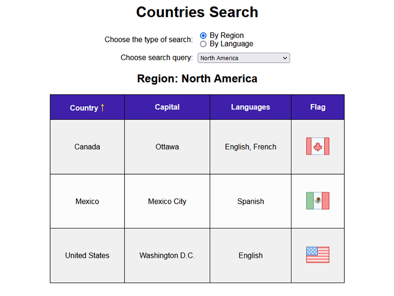
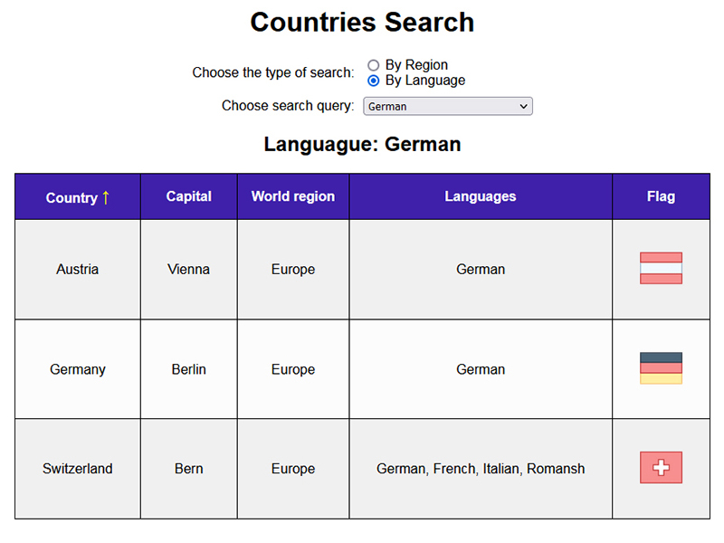

# Countries-Search

A simple web page on which the user can see information about the countries of the world. First, you need to select search by world region or language. Then a drop-down list becomes available. A data table appears according to the selected value.

The main task when creating this page was to use JavaScript to create drop-down lists and a table with countries.

Country flags icons are taken from [Icons8](https://icons8.com/)
